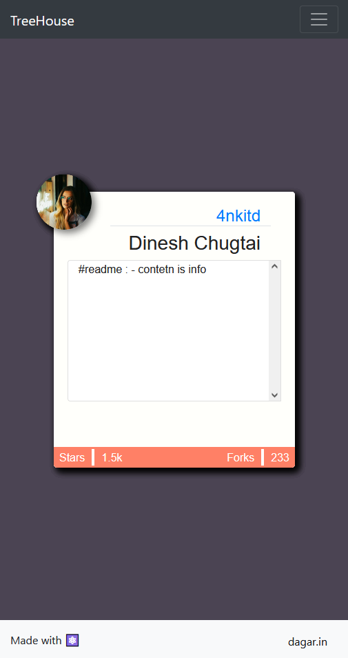

# G.tok | TreeHouse

idea is to make a application that helps you dev discover new / exiting github repositories in a card swipe style

## Main goal

show user a feed of github repositories without login

## Future & Features

    - login with github only
    - star, watch and fork directly from app
    - follow people , ( if you follow someone on this app you'll be following him/her/other on github too & wise-versa ) 
    - Check language Graph
    - Contributes list - ( allow you to follow them directly )

# demo of current UI

