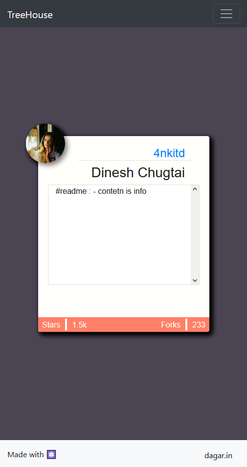

# G.tok | TreeHouse

Discover trending and exciting GitHub repositories in a fast, interactive card-swipe style interface.



## Features

- 🌟 **Live GitHub Repository Feed**: Automatically fetches top trending repositories directly from GitHub's REST API.
- 🎴 **Card Swiping Mechanics**: Interactive Tinder-style swipe gestures (Swipe Right to Save/Star, Swipe Left to Pass).
- 🏷️ **Language Filter**: Filter repositories by language (JavaScript, TypeScript, Python, Go, Rust, C++, Java).
- ⭐️ **Saved Repositories Manager**: Store starred repositories locally in `localStorage` and view/manage them anytime via the Starred Drawer.
- 🔗 **Direct GitHub Integration**: Inspect repository stats (stars, forks, description, owner) and open repositories directly on GitHub.
- 📱 **Responsive & Modern UI**: Built with React, Bootstrap, and dark mode developer aesthetics.
- ⚡ **Resilient Offline Fallback**: Includes a curated fallback dataset when GitHub API rate limits occur or network is offline.

## Getting Started

### Prerequisites

- Node.js (v16+)
- npm or yarn

### Installation

1. Clone the repository:
   ```bash
   git clone https://github.com/4nkitd/gtok.git
   cd gtok
   ```

2. Install dependencies:
   ```bash
   npm install
   ```

3. Start development server:
   ```bash
   npm start
   ```

4. Build for production:
   ```bash
   npm run build
   ```

5. Run test suite:
   ```bash
   npm test
   ```

## License

MIT
