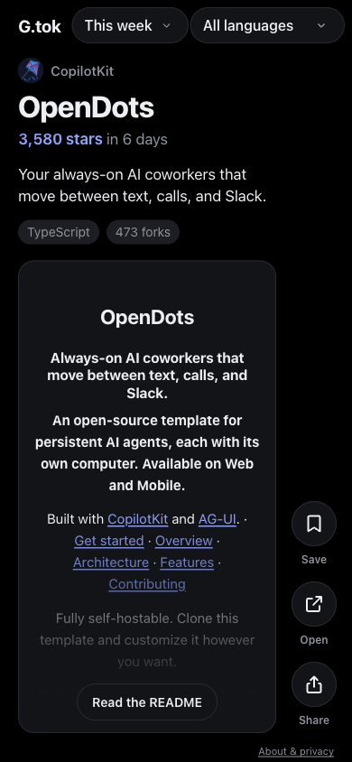

# G.tok

Discover recently created GitHub repositories, one screen at a time. Scroll through projects, read their READMEs without leaving the feed, and open the ones worth exploring.

[Open G.tok](https://gtok.dagar.in) | [Roadmap](ROADMAP.md) | [Privacy](https://gtok.dagar.in/privacy)



## What you can do

- Browse a vertical, snap-scrolling feed on a phone or desktop.
- Filter by creation window: today, this week, or this month. Narrow results by programming language.
- See descriptions, topics, stars and forks, then expand the README in a reading panel.
- Save a repository in this browser, open it on GitHub, or share its link.
- Skip repositories you've already viewed using this browser's local seen history.
- Use your system's light or dark theme, with reduced-motion preferences respected.

The feed ranks recently created repositories by total stars. It does not measure recent star growth or reproduce GitHub's Trending page. Saves are local bookmarks, not GitHub stars. A saved-list screen is still planned.

### Keyboard controls

| Key | Action |
| --- | --- |
| `J` / `↓` | Next repository |
| `K` / `↑` | Previous repository |
| `S` | Toggle local save |
| `O` | Open on GitHub |
| `R` | Read the full README |
| `Esc` | Close the README panel |

## How it runs

One Cloudflare Worker serves the built frontend and the API on the same domain. D1 holds shared GitHub response caches and daily repository-open totals. Browsers do not need a GitHub token or account.

| Part | Technology |
| --- | --- |
| Frontend | React 19, TypeScript, Vite, CSS |
| Backend | TypeScript on Cloudflare Workers |
| Cache and aggregate counts | Cloudflare D1 |
| README rendering | marked and DOMPurify |
| Tests | Vitest, Testing Library, Miniflare and workerd |

## Run locally

Requires Node 24+ and npm.

```sh
git clone https://github.com/4nkitd/gtok.git
cd gtok
npm ci
npm run build
npm run db:local
npm run dev:worker
```

Open http://127.0.0.1:8787 for the built app and backend. For frontend hot reload, also run `npm run dev -- --host 127.0.0.1 --port 5199`. Vite proxies `/api` to the Worker on port 8787. The local database is separate from production.

## API and caching

| Endpoint | Purpose |
| --- | --- |
| `GET /api/health` | Verify the Worker can query the database |
| `GET /api/repos?window=week&language=Go&page=1` | Shared GitHub search cache |
| `GET /api/readme?repo=owner/repo` | Cached README for a repository already in the catalog |
| `POST /api/opens` | Increment a daily count, JSON body `{"repo":"owner/repo"}` |

Search accepts day/week/month, listed languages, pages 1–34, and an optional `asOf` UTC date equal to today or yesterday. This pins pagination across midnight without allowing arbitrary cache keys. Results represent total stars on recently created repositories, not measured star growth or GitHub Trending.

Search entries stay fresh for 15 minutes and usable as stale fallback for 24 hours. README entries stay fresh for 6 hours and usable for 7 days, including cached missing READMEs. README text is capped at 512 KiB. The browser still sanitizes Markdown before rendering it. Images remain hosted at their original URLs.

D1 provides one shared cache across Worker instances and locations. Atomic leases coalesce concurrent refreshes; bounded waits handle cold races. A global budget caps cache-miss searches at 8 per minute, and upstream rate-limit cooldowns are shared across filters. GitHub failures never replace last-good content. `X-Cache: MISS`, `HIT`, or `STALE` describes each response, and the feed labels stale results.

No GitHub credential is required initially. A dedicated read-only GitHub token can later be stored with `wrangler secret put GITHUB_TOKEN` to improve upstream quota. Never use a browser token, put a token in `VITE_*`, or commit `.dev.vars`. The token is sent only to api.github.com, not raw content hosts. An anonymous Cloudflare egress IP may still encounter GitHub rate limits on cold queries.

## Counts and privacy

The app records repository-open actions from titles, Open links, the README panel's GitHub link, and the O shortcut. It does not track scrolling, saves, shares, owner links, or arbitrary README links. Context-menu opens may not be counted. Navigation stays direct to GitHub and works independently of the counter endpoint.

Only `(UTC day, repository, opens)` is stored. There are no visitor IDs, individual histories, cookies, stored IPs or fingerprints in the application. Same-origin checks, bounded JSON bodies, known-repository validation, and an aggregate write budget reject basic abuse. These checks do not prevent bots from forging HTTP requests. Counts are approximate opens, not unique visitors or confirmed GitHub visits. Repeated opens can count repeatedly. No recommendations or public analytics API are enabled yet.

Daily totals expire after 30 days via the daily cron. Local saves and seen history remain exclusively in localStorage. Worker request observability is disabled. Cloudflare still handles network metadata for delivery and security. Read the [public privacy disclosure](https://gtok.dagar.in/privacy).

Inspect the 7-day aggregate report using authenticated Wrangler:

```sh
npm run stats
```

## Checks and deployment

Run checks without publishing:

```sh
npm run check
```

Deploy using the configured Cloudflare account:

```sh
npm run deploy
```

Checks include frontend tests, SQLite/D1 tests, and a compiled-Worker test in workerd with a mock GitHub service. They also run typechecking, lint, a Vite production build, and a Worker upload dry run. CI runs checks only. Deployment applies migrations to the dedicated `gtok-db` database and deploys static assets plus the API together. The Worker Custom Domain provisions DNS and HTTPS for `gtok.dagar.in`.

The initial schema is additive. Future code rollbacks use `wrangler rollback <version-id>` and must remain compatible with deployed migrations. A code rollback does not restore D1 contents. Never drop or reset the production database to roll back a release.

For your own deployment, authenticate Wrangler, create a D1 database in your account, and replace `account_id`, the D1 database ID, and the custom domain in [wrangler.jsonc](wrangler.jsonc) before deploying. The checked-in settings belong to the live G.tok instance.

See [deployment verification](DEPLOYMENT.md) for the published version and live checks.

## What's next

Saved-list UI, history reset, PWA installation and recommendations remain future work. See [ROADMAP.md](ROADMAP.md) for the remaining milestones. Aggregate counts are being collected now; no personalized or community recommendation ranking is enabled yet.
